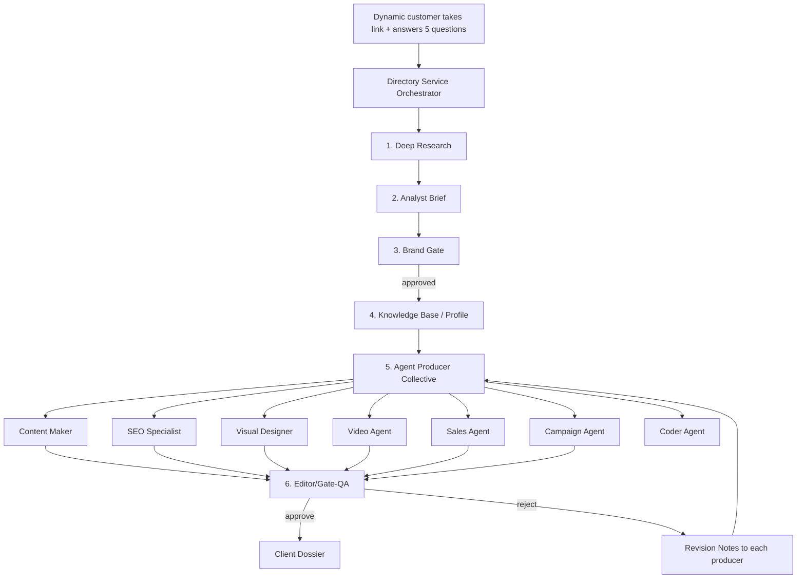

# 🔭 Directory Service — Agentic Workflow Blueprint

**Status:** Design blueprint · **Domain:** Customer Intelligence + Full-Agency Delivery

The **Directory Service** is the on-boarding engine of Treetiti. A prospective
client gives us **one link** (their website, Instagram, LinkedIn, or store) plus
answers to a **short intake questionnaire**. From there the whole AI agency runs:
it researches the client's business in the real world, builds a deep customer
profile, and then **every specialist agent produces its deliverable to
perfection** — content, images, video, sales copy, SEO, brand, campaign,
analytics, even code.

The philosophy: **one input, a complete agency-grade output, zero human
hand-holding.**

---

## 1. Why this matters (the pitch)

A normal agency asks a client to fill a 40-question form, waits two weeks, then
shows one draft. Treetiti's Directory Service inverts this:

1. Client hands over **a single link** + answers **5 short questions**.
2. The system **autonomously researches** the client's business (site, brand
   assets, competitors, audience, pricing, tone).
3. The **whole 11-agent team** then works in parallel to produce every
   deliverable that business needs — on-brand, per-agent, gated by QA.
4. The owner reviews one compiled **Client Dossier** and approves.

---

## 2. Inputs

### 2.1 The single link
> Customer's business presence — anything that reveals who they are:
> - website / landing page URL
> - Instagram / LinkedIn / Facebook profile
> - online store / shop page
> - a PDF menu / catalog link

### 2.2 The intake questionnaire (5 questions)
Asked once per client, stored as the client profile seed:

| # | Question | Maps to |
|---|----------|---------|
| 1 | What is your business, in one line? | positioning / sector |
| 2 | Who is your dream customer? (age, industry, spend) | target_audience |
| 3 | What is the #1 goal right now? (sell / brand / leads) | campaign objective |
| 4 | Who are your main competitors? | competitor research seed |
| 5 | What tone do you want? (luxury, bold, friendly…) | brand voice |

> If a question is unanswered, the system **derives** it during deep research
> from the link and flags it with a low confidence score — it never blocks.

---

## 3. High-level flow



---

## 4. The intake → research → profile (stages 1–4)

### Stage 1: Deep Research *(market_research agent, `run()`)*
- Takes the link + questionnaire seed.
- Uses **real web search** (DuckDuckGo, keyless) for the business, its
  competitors, and its sector — via `app/services/search.py`.
- Scrapes page text from the customer's own URL (`fetch_text`).
- Outputs: `trend`, `business_problem`, `content_opportunity`,
  `target_customer`, `sources`. *(matches `ResearchOpportunity` DB model)*

### Stage 2: Analyst *(analytics agent, `analyze_research()`)*
- Keeps the raw data, writes a strategic **insight brief** with
  success metrics and scoring reasons.

### Stage 3: Brand Gate *(brand agent, `gate_idea()`)*
- **Pre-flight** the angle/positioning BEFORE any content is written.
- Rejects off-brand angles, returns a `refined_angle`, assign a score.

### Stage 4: Client Profile distributed to all agents
- The brand-refined brief becomes the **single source of truth** shared by
  the whole collective — so every producer speaks the same on-brand message.

---

## 5. The agent producer collective (the "Directory")

Each agent receives the **client profile** and its specific task, returns a
deliverable, then submits to QA.

| Agent (key) | Role | Handles | Output |
|-------------|------|---------|--------|
| `content` | Content Maker | blog, ads, emails, social, landing copy | markdown copy |
| `image` (visual) | Visual Designer | hero image, social graphic, moodboard, infographic | image concept + prompt |
| `video` | Video Agent | reels, cinematic spots, storyboards | script/storyboard |
| `seo` | SEO Specialist | meta title, keywords, schema, alt text | JSON plan |
| `sales` | Sales Agent | outreach, follow-up, funnels | copy blocks |
| `campaign` | Campaign Agent | launch plan, positioning strategy | strategy doc |
| `analytics` | Analyst | forecast, KPIs, risk checks | insight brief |
| `developer` | Coder | landing page, script, integration | working code |
| `image`'s sibling `editor` | Editor / QA | review, veto | JSON grade |
| `brand` | Brand Guard | voice consistency, gate | scores |
| `market_research` | Researcher | competitor & market intel | dossier |

> Architecture note: the production pipeline today wires `market_research →
> analytics → brand gate → content` (`app/services/pipeline.py`). The Directory
> Service **broadens** that spine from a single ISE parallel fan-out to all the
> producers above, with the same brand gate first.

---

## 6. Quality gate — Editor veto (CEO / QA)

Every producer output must pass `app/agents/editor.py`'s `gate()` before it
reaches the client. Five criteria (1–10):

1. **Accuracy** — facts, claims, data grounded in research.
2. **Voice Consistency** — matches the client's approved brand voice.
3. **Clarity** — no jargon bloat, easy to read.
4. **Engagement** — strong hook, flow, CTA.
5. **SEO Readiness** — keywords, structure, meta.

- **Reject** if any score < 7 → specific `revision_notes` are sent back to that
  producer only (the collective retries on the offending agent, not everyone).
- **Approve** → consumed into `Client Dossier`.
- Editor has **no failover** — it runs on the reliable tier by design.

**SEO gate** (`app/agents/seo.py`): fills `meta_title` (50–60 chars),
`meta_description` (150–160), `target_keywords` (primary/secondary/long-tail),
`schema_markup` (JSON-LD), `internal_links`, `image_alt_texts`,
`content_optimizations`, `readability_target: "8th grade"`.

---

## 7. Output — The Client Dossier

The orchestrator compiles every approved deliverable into a single
**Client Dossier**:

```
/dossier/<client_id>/
├── 00_client_profile.json      (link + answers + researched profile)
├── 01_research.md              (competitor + SWOT + positioning)
├── 02_analyst_brief.md         (strategy insight + success metrics)
├── 03_brand_gate.md            (approved/vetoed + refined angle)
├── 04_content/                 (blog, ads, email, social, copy)
├── 05_visual/                  (image concepts + generation prompts)
├── 06_video/                   (reels, spots, storyboards)
├── 07_seo/                     (meta, keywords, schema, links)
├── 08_sales/                   (outreach, follow-ups)
├── 09_campaign/                (launch plan)
├── 10_analytics/               (KPI frame, forecasts)
├── 11_code/                    (landing page, integrations)
└── 99_qa_report.md             (editor with scores + approvals)
```

The whole thing is authored, flown and gated by the **Dispatcher
(`app/dispatcher.py`)**, which routes prompts to the right agent by keyword and
LLM classification.

---

## 8. Free-tier reliability (the "no key, no failure" doctrine)

- **Search** is DuckDuckGo — keyless. Research never breaks.
- **Models** resolve from `settings.agent_models`; `settings.agent_models_failover`
  defines per-agent failover (e.g. `market_research` / `developer` → gemini 2.5).
- **Rate limits** per provider are enforced in `app/ratelimit.py` with
  per-key daily counters; Google rotates across `GOOGLE_AI_STUDIO_KEY_1/2/3`.
- **Editor** has veto and deliberately no failover (must be a reliable model).
- Each stage is **optional-safe** — if a research fails, downstream producers
  still produce, grounded in internal knowledge.

---

## 9. Next moves to make the blueprint real

1. Add the **intake questionnaire** model + a `/onboard` endpoint that stores a
   `ClientProfile` (link + answers) in DB.
2. Write an **orchestrator** (`app/services/directory.py`) that:
   - consumes a `ClientProfile`,
   - runs the 4-stage research/gate spine,
   - fans out to the producer collective,
   - funnels every deliverable through `editor.gate()`,
   - assembles the Client Dossier.
3. Expose `/directory/{id}` and `/directory` **routers** to inspect the dossier
   and re-trigger agents.
4. Wire a **webhook / Telegram** notify when a dossier is ready.

*Copyright (C) Treetiti AI Marketing OS · internal design document.*