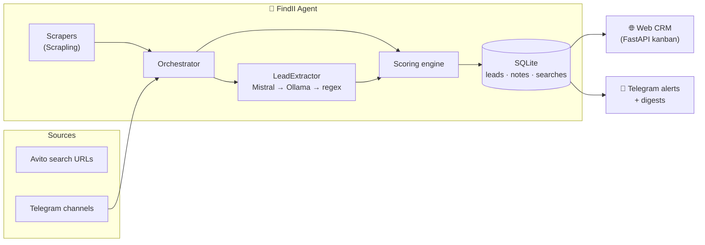

<h1 align="center">🤖 FindII</h1>
<p align="center">
  <b>Autonomous AI lead-generation agent for real estate.</b><br>
  Scrapes Avito with <a href="https://github.com/D4Vinci/Scrapling">Scrapling</a> + monitors Telegram channels,
  extracts structured leads with LLMs, scores them 0–100, and runs your sales pipeline
  in a built-in web CRM — with Telegram alerts on every hot lead.
</p>

<p align="center">
  
  
  
  
  
</p>

---

## Why FindII?

Manually hunting listings across Avito cities and Telegram channels is dead time.
FindII turns it into a pipeline: **scrape → understand → score → route → close.**

```
┌─────────────────┐   ┌──────────────────┐   ┌─────────────┐   ┌──────────────┐
│  SOURCES         │   │  AI EXTRACTION    │   │  SCORING     │   │  DELIVERY     │
│  Avito (Scrapling│──▶│  deal type, price,│──▶│  0–100 rules │──▶│  🔥 Telegram  │
│  stealth engine) │   │  city, area,      │   │  dedupe by   │   │  alerts       │
│  TG channels &   │   │  rooms, contact…  │   │  content hash│   │  🗂 Web CRM   │
│  groups          │   │  Mistral→Ollama→  │   │              │   │  kanban board │
│                  │   │  regex fallback   │   │              │   │  CSV export   │
└─────────────────┘   └──────────────────┘   └─────────────┘   └──────────────┘
```

## ✨ Features

| Area | What you get |
|---|---|
| 🕷 **Avito scraping** | Paste any Avito search URL (`/addsearch`), FindII paginates it on a schedule via **Scrapling** — fast TLS-impersonated fetches that auto-escalate to a **stealth browser** when blocked |
| 📡 **Telegram monitoring** | Bot-as-admin ingests every post from your real-estate channels/groups |
| 🧠 **LLM extraction** | Strict JSON schema output; graceful provider chain **Mistral → local Ollama → regex fallback** (works with *zero* API keys) |
| 🔢 **Smart scoring** | Phone +30, price +15, location +10… only leads above your threshold get pushed |
| 🗂 **Web CRM** | Kanban pipeline (drag & drop), lead detail pages, call notes, conversion stats, CSV export, password auth — FastAPI, no build step |
| 🤖 **Telegram ops** | `/addsearch`, `/scrape`, `/stats`, `/leads`, `/mark`, `/export` and scrape-cycle digests |
| 🛡 **Dedupe** | Message-level **and** content-hash dedupe catches cross-channel/city reposts |
| 🐳 **Deploy anywhere** | Single container, SQLite storage, `docker compose up -d` |

## 🏗 Architecture



## 🚀 Quick start

### Docker (recommended)

```bash
git clone https://github.com/alihosseinabadi/findii.git
cd findii
cp .env.example .env        # fill in TELEGRAM token at minimum
docker compose up -d --build
# CRM ready on http://localhost:8080
```

### Manual

```bash
git clone https://github.com/alihosseinabadi/findii.git
cd findii
cp .env.example .env

pip install -r requirements.txt
# optional: enable the stealth-browser engine (downloads ~400MB browsers)
scrapling install

python main.py
```

### First-run setup (2 minutes)

1. Create a bot with [@BotFather](https://t.me/BotFather) → put the token in `.env`
2. Send `/start` to your bot
3. Save an Avito search:
   ```
   /addsearch https://www.avito.ru/moskva/kvartiry/prodam-2-komnatnye moscow-2br
   ```
4. Add the bot as **admin** to any Telegram channel you want mined
5. Set `DESTINATION_CHAT_ID` to your team chat → hot leads start arriving 🎉

## 💬 Telegram commands

| Command | Description |
|---|---|
| `/addsearch <avito-url> [label]` | Save an Avito search to the scrape schedule |
| `/searches` / `/delsearch n` / `/togglesearch n` | Manage saved searches |
| `/scrape` | Run all searches immediately |
| `/stats` | Totals, hot leads, conversion %, per-source breakdown |
| `/leads [n]` | Top-n leads with scores |
| `/mark <id> <status>` | Move a lead through the pipeline |
| `/city <name>` | Pull that city's OSM map (one-time download, cached) — every new lead is pinned to a real building: Confirmed (+10) / Probable (+5) / Uncertain (no invented coords) |
| `/mini` | Open the Telegram Mini App (needs `CRM_PUBLIC_URL=https://…`) |
| `/export` | Full CSV export |

## 📱 Telegram Mini App + landing

- **Mini App** (`/mini` route): leads, search, details and pipeline buttons inside Telegram. Auth = Telegram `initData` signature check (`crm/mini_auth.py`) — no passwords floating around. Requires a public `https://` `CRM_PUBLIC_URL` (Telegram refuses `http://` for Mini Apps).
- **Landing** (`/landing` route): simple one-page site explaining the product — point your bio link at it.
- **Try-it-live** (`POST /api/try`): paste any listing on the landing page — the real regex extractor + scorer + map matcher run in a read-only sandbox (nothing saved). Public counts at `GET /api/public-stats`.

## 🌐 Web CRM

| Route | Description |
|---|---|
| `/board` | Kanban pipeline — drag cards between stages, live stats header, full-text search |
| `/lead/{id}` | Lead dossier: all extracted fields, score breakdown, raw source text, notes timeline |
| `/api/leads?status=&min_score=&q=` | JSON API for integrations |
| `/api/stats` | Pipeline statistics JSON |
| `/export.csv` | Download everything |

Set `CRM_PASSWORD` in `.env` to protect it; set `CRM_PUBLIC_URL` so Telegram alerts deep-link into the right lead page.

## ⚙️ Configuration (`.env`)

| Variable | Default | Description |
|---|---|---|
| `TELEGRAM` | — | Bot token from @BotFather |
| `DESTINATION_CHAT_ID` | — | Chat receiving qualified leads + digests |
| `ADMIN_IDS` | — | User ids allowed admin commands |
| `AI_PROVIDER` | `auto` | `auto` \| `mistral` \| `ollama` \| `regex` |
| `MISTRAL_API_KEY` | — | [console.mistral.ai](https://console.mistral.ai/api-keys/) |
| `OLLAMA_BASE_URL` / `OLLAMA_MODEL` | `localhost:11434` / `llama3.1` | Local LLM option |
| `SCRAPER_ENGINE` | `auto` | `http` fast fetch → escalates to `stealth` browser on blocks |
| `SCRAPE_INTERVAL_MINUTES` | `30` | Scheduler cadence |
| `SCRAPE_MAX_PAGES` / `SCRAPE_ENRICH_DETAILS` | `2` / `false` | Pagination depth / open each listing for description |
| `MIN_LEAD_SCORE` | `50` | Alert threshold (0–100) |
| `CRM_PORT` / `CRM_PASSWORD` / `CRM_PUBLIC_URL` | `8080` / — / — | Web CRM options |

## 🔢 Scoring model

| Signal | Points |
|---|:---:|
| Real estate detected | +15 |
| Deal type identified | +10 |
| Property type identified | +10 |
| **Phone contact** | **+30** |
| Price specified | +15 |
| Location specified | +10 |
| Area / rooms specified | +5 each |
| Urgency signals ("срочно", "asap"…) | +10 |
| Verifiable listing URL | +5 |

≥80 🔥 hot · ≥60 ✅ good · everything else stays searchable in the CRM.

## 📁 Project structure

```
findii/
├── main.py               # one process: bot polling + scheduler + CRM server
├── config.py             # env-driven configuration
├── agent/
│   └── orchestrator.py   # ingest → extract → score → persist → notify
├── scrapers/
│   ├── base.py           # Scrapling engine chain + offline-capable parser
│   └── avito.py          # search URL builder, card parser, price/address logic
├── ai/
│   ├── extractor.py      # Mistral → Ollama → regex (multilingual RU/EN)
│   └── prompts.py        # strict JSON extraction prompt
├── bot/handlers.py       # Telegram ingestion, notifications, commands
├── core/
│   ├── models.py         # Lead dataclass
│   ├── db.py             # SQLite: leads, searches, notes, stats, export
│   └── scoring.py        # rule-based scoring engine
├── crm/
│   ├── app.py            # FastAPI kanban CRM + JSON API
│   ├── auth.py           # HMAC cookie sessions
│   └── templates/ static/
├── Dockerfile · docker-compose.yml · .env.example
└── README.md
```

## ⚠️ Disclaimer

Avito scraping is for personal research/lead-gen use. Respect the platform's terms of
service, robots.txt and local data-protection laws. Use polite delays (built in),
avoid hammering, and prefer official APIs where available.

## 🛣 Roadmap

- [ ] CIAN / Domclick adapters (same scraper interface)
- [ ] Auto-reply qualification questions to sellers
- [ ] Telegram Mini App CRM view
- [ ] Near-duplicate detection via embeddings
- [ ] Multi-agent mode: per-city worker fleets

## 🙏 Credits

- Powered by [**Scrapling**](https://github.com/D4Vinci/Scrapling) by [@D4Vinci](https://github.com/D4Vinci)
- Evolved from my earlier projects: [telegram_bot](https://github.com/alihosseinabadi/telegram_bot) and [HSBC churn analysis](https://github.com/alihosseinabadi/HSBC-churn-prediction-analysis)

## 📬 Contact

Built by [@alihosseinabadi](https://github.com/alihosseinabadi) · hosseinabadiia@gmail.com
